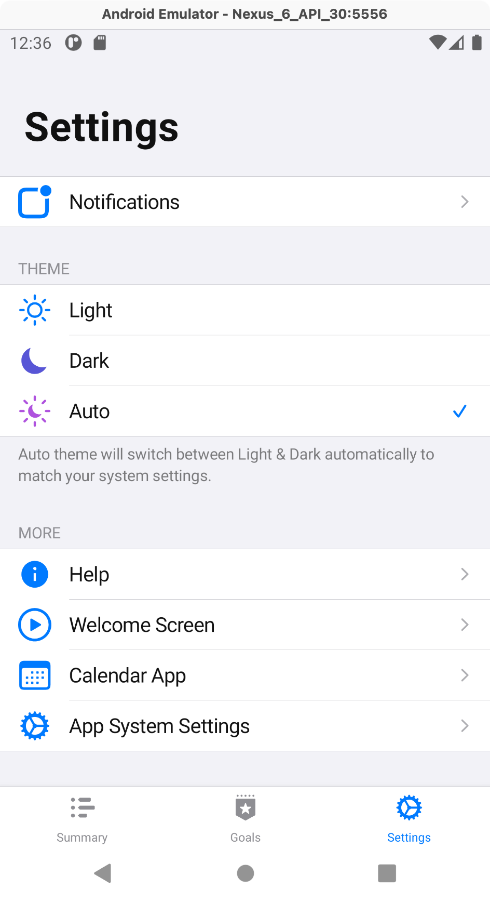
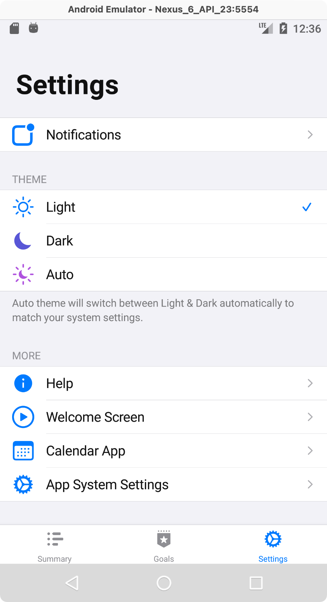
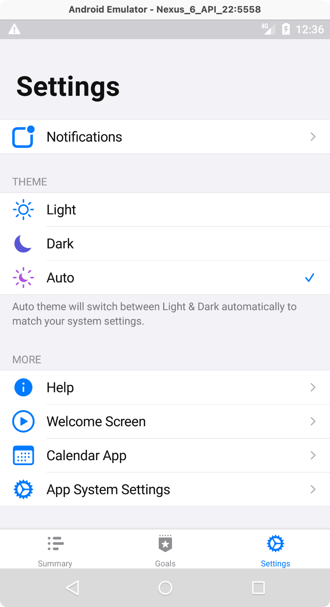
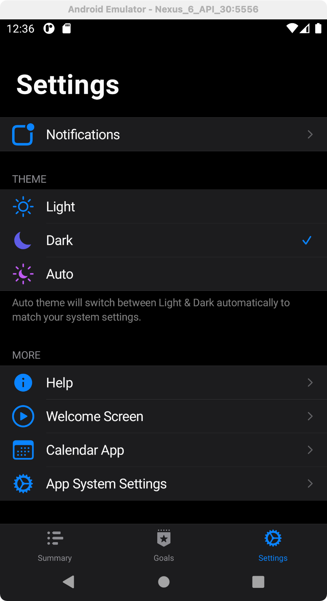
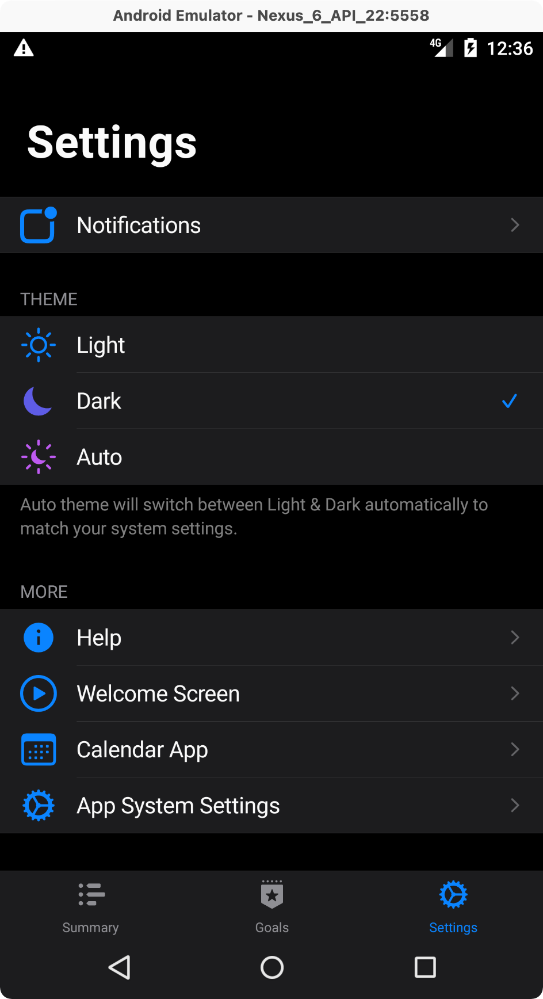

# react-native-transparent-status-and-navigation-bar

<a href="https://github.com/MoOx/react-native-transparent-status-and-navigation-bar?sponsor=1">
  
</a>

[ ](https://www.npmjs.com/package/react-native-transparent-status-and-navigation-bar)
[](https://github.com/MoOx/react-native-transparent-status-and-navigation-bar/actions)
[](https://github.com/MoOx/react-native-transparent-status-and-navigation-bar)  
[](https://github.com/MoOx)
[](https://twitter.com/MoOx)
[](https://github.com/MoOx/react-native-transparent-status-and-navigation-bar?sponsor=1)

Easily handle transparent status and navigation bar for React Native apps

- Fully works starting Android 6.
- For Android 5 or less, enables translucent bar with fallbacks (you can choose light & dark colors).
- _Does nothing for iOS as this is built-in in the system._

## Preview

| Android 10+ (API 29+)                                          | Android 9 to 6 (API 26 to 28)                                  | Android 5 and less                                             |
| -------------------------------------------------------------- | -------------------------------------------------------------- | -------------------------------------------------------------- |
|  |  |  |
|   |   |   |

ℹ️ _Note that native Dark Mode only comes with Android 10._

## Recommendations

This module works best with

- [react-native-safe-area-context](https://github.com/th3rdwave/react-native-safe-area-context) (to allow you to handle padding below status and navigation bar)
- [react-native-bootsplash](https://github.com/zoontek/react-native-bootsplash) to handle startup splash screen

## Installation

```sh
npm install react-native-transparent-status-and-navigation-bar
```

## Setup

You have 2 parts to add: one Android call in `MainActivity.java` and one JavaScript call in your `App.js`

### 1. Android Setup

Edit `android/app/src/main/java/{com/your/project/name}/MainActivity.java` file

```java
//...

// ⬇
// ⬇ ADD THIS
import android.os.Bundle;

import com.facebook.react.ReactActivity;
// ⬇
// ⬇ ADD THIS
import io.moox.rntransparentstatusandnavigationbar.RNTransparentStatusAndNavigationBar;

public class MainActivity extends ReactActivity {

  // …

  // ⬇
  // ⬇ ADD THIS
  //    Note that if you are using react-native-bootsplash,
  //    you will already have this function.
  //    In this case, just add the last line of this function
  @Override
  protected void onCreate(Bundle savedInstanceState) {
    super.onCreate(savedInstanceState);

    // ⬇ Requirement
    RNTransparentStatusAndNavigationBar.init(MainActivity.this);
  }
```

### 2. JavaScript Setup

Edit your `App.js` to add at the top:

```js
import * as React from "react";
// ...

// ⬇ Requirement
import * as TransparentStatusAndNavigationBar from "react-native-transparent-status-and-navigation-bar";

// ⬇ Requirement
TransparentStatusAndNavigationBar.init();

// This is to change React Native `StatusBar` default values for `translucent` (and `backgroundColor` fallback for Android 5 or less).

export default function App() {
    // ...

    // Alternatively, you can put the init here to have this always up to date
    // which can be interesting when you play with StatusBar app reloads during development
    // React.useEffect(() => {
    //   TransparentStatusAndNavigationBar.init();
    // }, []);

    // ⬇ OPTIONAL **in case of custom themes ONLY**

    // If your app use a custom theme instead of just relying on native Dark Mode,
    // you can easily force "light" or "dark" fallbacks for Android 5-
    const { mode } = useTheme()
    // ⬆ useTheme() here is a imaginary hook (that you will create yourself)
    // mode is also something imagined that can tell if the theme is dark or light
    // depending on the colors of the theme
    React.useEffect(() => {
      TransparentStatusAndNavigationBar.setBarsStyle(
        mode === "dark" ? "dark-content" : "light-content",
        // ~animated=true // or false // won't be used for Android
      )
    }, [mode])

    // ...
    // Your actual app root

```

## Limitation

### React Native StatusBar can "cancel" status bar background color

See below for more informations.

### ReactNative `<StatusBar>` can cancel the status bar transparency

This module just does what's it's named after. After launch, it does nothing more.

⚠️ If you use React Native `StatusBar` with `barStyle` as the only prop, the background will be affected as by default React Native module deactivate transluscent/transparent mode.
Simple workaround is to always send use 2 props to ensure React Native doesn't rollback some of the setup made by this module. You can simply always use `<StatusBar translucent={true} backgroundColor={"transparent"} /* your props like barStyle etc*/ />`.
You can also create your own `StatusBar` that will just always send this props or use the status bar module provided by this module `TransparentStatusBar` which does exactly this.

`TransparentStatusAndNavigationBar.init()` should modify React Native `StatusBar` default values to prevent this problem. Read carefully setup instructions before opening an issue.

### During a few _milliseconds_ on launch, status bar and navigation bar won't be transparent.

This is because this module works using Java code.
If you use a splash screen ([react-native-bootsplash](https://github.com/zoontek/react-native-bootsplash)) is recommended) this is really not a problem as this is barely visible (or not even visible depending on your splash screen and the workaround you will choose.)
You have 2 workarounds for this:

#### Solution 1: Start with solid colors

Note that this solution can create a small "jump" when your splashscreen load and when status/navigation bar becomes transparent.
In your `android/app/src/main/res/values/styles.xml`, use the following

```xml
<resources xmlns:tools="http://schemas.android.com/tools">

    <style name="AppTheme" parent="Theme.AppCompat.DayNight.NoActionBar">
        <!-- Change "transparent" below with android color you want or custom colors -->
        <!-- https://developer.android.com/guide/topics/ui/look-and-feel/themes#CustomizeTheme -->
        <item name="android:statusBarColor" tools:targetApi="lollipop">@android:color/transparent</item>
        <item name="android:navigationBarColor" tools:targetApi="lollipop">@android:color/transparent</item>
    </style>

    <!-- You might have something like this... -->
    <style name="BootTheme" parent="AppTheme">
        <item name="android:background">@drawable/bootsplash</item>
    </style>

</resources>

```

#### Solution 2: Start with "translucent" bars

This solution ensure no splashscreen jump when your app start.
In your `android/app/src/main/res/values/styles.xml`, use the following

```xml
<resources xmlns:tools="http://schemas.android.com/tools">

    <style name="AppTheme" parent="Theme.AppCompat.DayNight.NoActionBar">
        <!-- Workaround for fully transparent status bar and navigation bar: -->
        <!-- we use translucent to ensure no jump and minimal impact on app startup -->
        <item name="android:windowTranslucentStatus" tools:targetApi="kitkat">true</item>
        <item name="android:windowTranslucentNavigation" tools:targetApi="kitkat">true</item>
    </style>

    <!-- You might have something like this... -->
    <style name="BootTheme" parent="AppTheme">
        <item name="android:background">@drawable/bootsplash</item>
    </style>

</resources>
```

_Note that this 2 translucent flags will be removed by the module when starting to ensure they don't cause conflicts with others necessary flags._

---

## Changelog

Check the [changelog](./CHANGELOG.md) for more informations about recent
releases.

---

## Contribute

Read the
[contribution guidelines](https://github.com/MoOx/.github/blob/main/CONTRIBUTING.md)
before contributing.

## Code of Conduct

I want this community to be friendly and respectful to each other. Please read
[my full code of conduct](https://github.com/MoOx/.github/blob/main/CODE_OF_CONDUCT.md)
so that you can understand what actions will and will not be tolerated.
